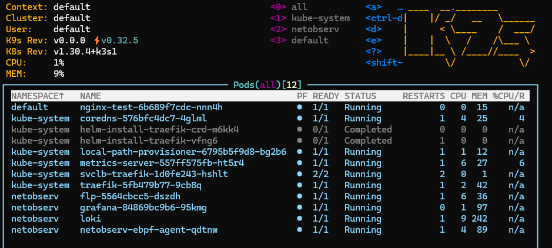
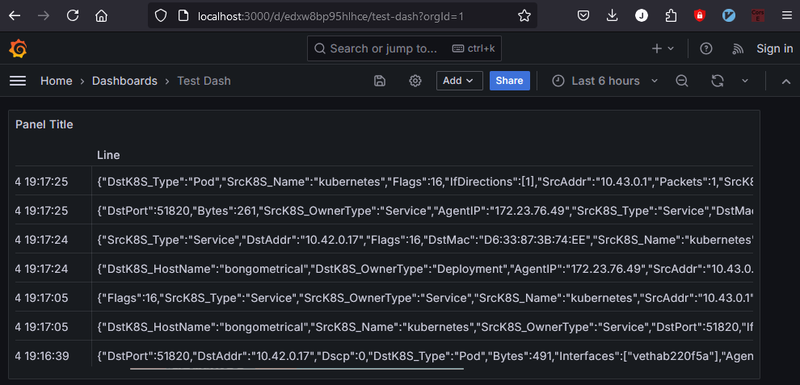

# Minimal Kubernetes + Netobserv + Loki + Grafana Setup 

This is a minimal setup for [netobserv](https://github.com/netobserv), [Loki](https://grafana.com/oss/loki/) and Grafana on Kubernetes ([k3s](https://k3s.io/)).



## Prerequisites
- A Kubernetes cluster, run `./k3s.sh` to bring up a local cluster.
- Read https://github.com/netobserv/netobserv-ebpf-agent/tree/main/deployments 

## Setup

Apply the permissions:

```bash
kubectl apply -f ./perms.yml
```

Then, create deploy loki:
```bash
curl -S -L https://raw.githubusercontent.com/netobserv/documents/main/examples/zero-click-loki/1-storage.yaml | kubectl create -n netobserv -f - 
curl -S -L https://raw.githubusercontent.com/netobserv/documents/main/examples/zero-click-loki/2-loki.yaml | kubectl create -n netobserv -f -
```

Finally bring up eBPF and FLP:
```bash
kubectl apply -f ./flp-service.yml
```

## Generating Traffic

You can create a deployment of the nginx image:
```bash
kubectl apply -f ./nginx-test.yml
```

Then, port forward the service:
```bash
kubectl port-forward service/nginx 8080:80
```

Then, you can use `curl` to generate incoming traffic to the nginx service:
```bash
curl http://localhost:8080
```

Alternatively you can exec into the pod and run `curl` to generate outbound traffic: 
```bash
kubectl exec -it <pod-name> -- /bin/sh
curl 1.1.1.1
```

These connection logs should show up in Grafana.

## Accessing Grafana

To access Grafana, apply the config in `grafana.yml`:
```bash
kubectl apply -f ./grafana.yml
```

Then, port forward the Grafana service:

```bash
kubectl port-forward -n netobserv service/grafana 3000:3000
```

Then, open your browser and go to `http://localhost:3000`. You should be able to add the Loki datasource with `http://loki:3100` as the URL.



## Expalanation of the default logs
By default, you'll get these logs for each network flow:
- `"DstK8S_HostName"`: Hostname of the destination Kubernetes node.
- `"DstK8S_OwnerType"`: Type of Kubernetes object (e.g., Deployment) that owns the destination.
- `"AgentIP"`: IP address of the agent collecting the logs.
- `"SrcAddr"`: Source IP address.
- `"Bytes"`: Number of bytes transmitted.
- `"DstAddr"`: Destination IP address.
- `"DstPort"`: Destination TCP/UDP port.
- `"DstK8S_Type"`: Type of destination Kubernetes object (e.g., Pod).
- `"SrcK8S_Type"`: Type of source Kubernetes object (e.g., Service).
- `"DstMac"`: MAC address of the destination.
- `"TimeFlowStartMs"`: Timestamp when the flow started in milliseconds since epoch.
- `"DnsErrno"`: DNS error number.
- `"IfDirections"`: Array indicating interface directions.
- `"SrcPort"`: Source TCP/UDP port.
- `"TimeReceived"`: Timestamp when the log was received in seconds since epoch.
- `"Etype"`: Ethernet type.
- `"DstK8S_Name"`: Name of the destination Kubernetes object.
- `"TimeFlowEndMs"`: Timestamp when the flow ended in milliseconds since epoch.
- `"Interfaces"`: Array of interface names.
- `"SrcMac"`: MAC address of the source.
- `"Dscp"`: Differentiated Services Code Point value.
- `"Proto"`: Protocol number (e.g., 6 for TCP).
- `"SrcK8S_OwnerType"`: Type of Kubernetes object (e.g., Service) that owns the source.
- `"Packets"`: Number of packets transmitted.
- `"SrcK8S_Name"`: Name of the source Kubernetes object.
- `"Flags"`: TCP Flags.
- `"DstK8S_HostIP"`: IP address of the destination Kubernetes node.
